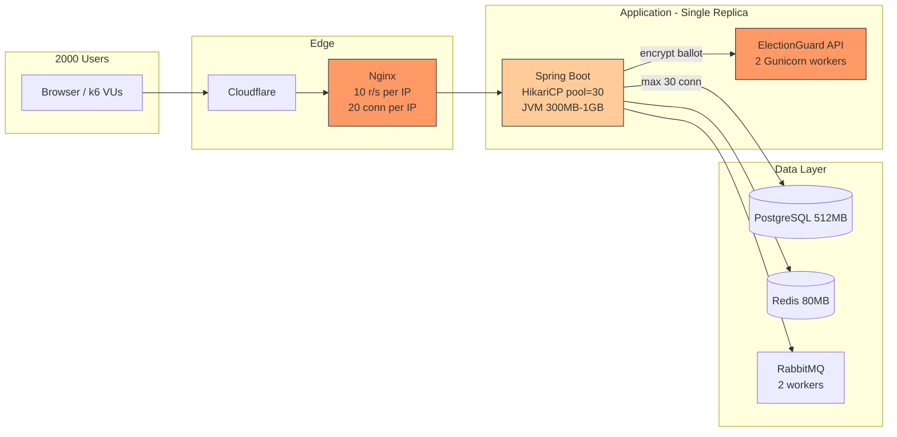

# AmarVote k6 Load Test Guide — 2000 Concurrent Users

Target site: **https://amarvote2026.me**

This document provides a complete k6 load-testing playbook to validate whether AmarVote can handle **2,000 simultaneous users** during an election. It includes runnable scripts, pre-test setup, success criteria, and a bottleneck analysis based on the current production architecture.

---

## Table of Contents

1. [Executive Summary](#1-executive-summary)
2. [Bottleneck Analysis](#2-bottleneck-analysis)
3. [Architecture Under Test](#3-architecture-under-test)
4. [Prerequisites](#4-prerequisites)
5. [Pre-Test Setup](#5-pre-test-setup)
6. [Test Scenarios](#6-test-scenarios)
7. [Running the Tests](#7-running-the-tests)
8. [Monitoring During Tests](#8-monitoring-during-tests)
9. [Success Criteria](#9-success-criteria)
10. [Remediation Roadmap](#10-remediation-roadmap)
11. [Appendix: Full k6 Scripts](#11-appendix-full-k6-scripts)

---

## 1. Executive Summary

**Host:** 4 GB RAM + 4 GB swap (amarvote2026.me cloud server)

Memory is budgeted so steady-state fits in RAM; swap absorbs load-test spikes.

> **Deploy vs load test:** GitHub auto-deploy always uses `nginx-proxy.conf` (rate limits ON).  
> Load tests require a **manual** nginx switch on the server — see [PRODUCTION_DEPLOY_AND_LOADTEST.md](./PRODUCTION_DEPLOY_AND_LOADTEST.md).

| Service | Container limit | Key setting |
|---------|----------------|-------------|
| Backend | 1024 MB | JVM `-Xmx768m`, Tomcat 200 threads |
| ElectionGuard API | 1024 MB | 4 workers × 2 threads (8 concurrent encrypt) |
| PostgreSQL | 384 MB | `max_connections=120`, `shared_buffers=96MB` |
| Redis | 96 MB | `maxmemory 64mb`, 2000 clients |
| RabbitMQ | 320 MB | worker concurrency 2–4 |
| **Total limits** | **~3.6 GB** | + ~400 MB OS ≈ 4 GB RAM |

**Election under test:** [Election 10](https://amarvote2026.me/election-page/10)  
**Candidates:** `A big name`, `nobo tobo`, `masnoon muztahid`

At 2000 simultaneous **voters encrypting**, expect queueing — 8 concurrent encryptions with swap-backed bursts. Browsing/dashboard at 2k is the realistic target on 4 GB.

### Quick start

See **[PRODUCTION_DEPLOY_AND_LOADTEST.md](./PRODUCTION_DEPLOY_AND_LOADTEST.md)** for the full cloud-server workflow.

```bash
# 1. Deploy via GitHub push to main (uses production nginx — normal)

# 2. On cloud server ONLY — switch to load-test nginx
cd ~/app
docker compose -f docker-compose.prod.yml -f docker-compose.loadtest.yml up -d nginx

# 3. Optional — free ~256 MB RAM
docker compose -f docker-compose.prod.yml stop prometheus grafana

# 4. Run k6 from your machine (secrets from .env, not committed)
./load-tests/run.sh scenarios/vote-encrypt-2000.js

# 5. On cloud server — restore production DDoS nginx
docker compose -f docker-compose.prod.yml up -d nginx prometheus grafana
```

---

## 2. Bottleneck Analysis

### 2.1 Critical — Will block 2k users today

#### A. Nginx rate limiting (`nginx-proxy.conf`)

Production Nginx enforces per-IP limits that prevent a single load generator from simulating 2,000 real users:

```nginx
limit_conn conn_limit 20;                          # 20 connections/IP
limit_req zone=global_limit burst=50 nodelay;      # 100 req/s global per IP
limit_req zone=api_limit burst=20 nodelay;         # 10 req/s on /api/
limit_req zone=auth_limit burst=5 nodelay;         # 10 req/min on auth paths
```

| Limit | Value | Effect |
|-------|-------|--------|
| `conn_limit` | 20/IP | k6 opens hundreds of connections → **429/503** |
| `api_limit` | 10 r/s/IP | Any scenario above ~10 API calls/s from one IP fails |
| `auth_limit` | 10 r/min/IP | Login/OTP tests fail immediately |
| `email_code_limit` | 1 r/min | Registration tests unusable |

**Fix for load testing:** Use a **staging** Nginx config without limits, or run **distributed k6** from many IPs (k6 Cloud, multiple VMs). Do **not** disable limits on production during a live election.

#### B. ElectionGuard API — crypto throughput

`Microservice/Dockerfile.api` runs:

```
gunicorn --workers 2 --worker-class sync --threads 1
```

Only **2 ballots can be encrypted at once**. Each `POST /api/create-encrypted-ballot` calls ElectionGuard `create_encrypted_ballot`, which is CPU-heavy (ElGamal operations).

At 2 workers, theoretical max ≈ **2 encryptions in flight**. If each takes 5–30 s:

- 2,000 users voting concurrently → **queue of 1,998+ requests**
- p95 latency for encryption → **minutes**, not seconds

Comments in Dockerfile mention 8 workers × 4 threads, but the actual CMD uses **2 sync workers**.

#### C. Single replica — no horizontal scaling

`docker-compose.prod.yml` / `docker-compose.local.yml` run **one** backend, **one** ElectionGuard API, **one** PostgreSQL instance. There is no load balancer pool behind Nginx for the API layer.

---

### 2.2 High — Degrades performance under load

#### D. Database connection pool (HikariCP)

`application.properties`:

```properties
spring.datasource.hikari.maximum-pool-size=30
spring.datasource.hikari.minimum-idle=10
spring.datasource.hikari.connection-timeout=30000
```

With 2,000 concurrent HTTP threads waiting on DB:

- Only 30 connections served at once
- Remaining requests block up to **30 s** then fail
- Risk of **pool exhaustion** during vote + tally overlap

PostgreSQL container limit: **512 MB** — insufficient for 2,000 idle connections; pool size correctly caps this, but causes queueing.

#### E. Backend JVM memory

Local compose: `-Xmx300m` in 768 MB container.  
Production guide: `-Xmx1024m` in 1280 MB container.

Under 2k concurrent requests:

- Thread stacks + request buffers + JPA entities → **heap pressure**
- G1GC with `MaxGCPauseMillis=200` → stop-the-world pauses visible as latency spikes
- `System.out.println` in hot paths (`ElectionController`) adds I/O overhead

#### F. Redis (80 MB, 20 connections)

Used for guardian credential cache and distributed locks. At 2k **voting** users Redis is lightly used, but:

- `max-active=20` Lettuce connections on backend
- 80 MB `maxmemory` with LRU — fine for voting, tight if tally/decryption runs concurrently

#### G. RabbitMQ workers (post-vote operations)

```properties
rabbitmq.worker.concurrency.min=2
rabbitmq.worker.concurrency.max=2
```

Tally/decryption is intentionally serialized. Not a voting bottleneck, but **2,000 ballots cast in minutes** creates a large backlog for post-election processing.

---

### 2.3 Medium — Noticeable under sustained load

#### H. HTTP client pool to ElectionGuard

`electionguard.max.connections=100`, `max.per.route=50` — adequate if backend scales, but useless when ElectionGuard only accepts 2 concurrent jobs.

#### H. Large ballot payloads

Ballots use PKCS#7 padding to **18,980 bytes** (`BallotPaddingUtil.TARGET_SIZE`). Every vote uploads ~19 KB binary + returns large JSON. At 2k concurrent:

- Nginx `client_max_body_size 20M` — OK per request
- Aggregate bandwidth: **~38 MB/s** sustained if all encrypt simultaneously
- Backend → ElectionGuard internal network becomes a hotspot

#### I. API logging

Every authenticated request may write to `api_logs` table — extra DB writes under load.

#### J. Cloudflare edge

`amarvote2026.me` sits behind Cloudflare. Under extreme load you may hit **Cloudflare rate limits or bot fight mode** before traffic reaches your origin. Monitor CF analytics during tests.

---

### 2.4 Bottleneck diagram



---

## 3. Architecture Under Test

| Service | Internal port | Memory limit | Role in load test |
|---------|--------------|--------------|-------------------|
| nginx | 443 | 64M | TLS, rate limits, reverse proxy |
| frontend | 80 | 128M | Static React assets |
| backend | 8080 | 768M–1280M | REST API, JWT auth |
| electionguard-api | 5000 | 512M | Ballot encryption |
| electionguard-worker | 5001 | 512M | Tally/decryption (async) |
| postgres | 5432 | 512M | Primary datastore |
| redis | 6379 | 128M | Cache, locks |
| rabbitmq | 5672 | 384M | Job queues |

**Key API paths for load testing:**

| Journey | Endpoints |
|---------|-----------|
| Health | `GET /api/health` |
| Session | `GET /api/auth/session` |
| Browse | `GET /api/all-elections`, `GET /api/election/{id}` |
| Vote | `POST /api/eligibility` → `POST /api/create-encrypted-ballot` → `POST /api/cast-encrypted-ballot` |

Auth uses **HS256 JWT** (`Authorization: Bearer` or `jwtToken` cookie). For sustained load tests, **pre-generate JWTs** with the server `JWT_SECRET` — do not hammer `/api/auth/request-otp` (email + Nginx auth limit).

---

## 4. Prerequisites

### 4.1 Install k6

```bash
# Ubuntu/Debian
sudo gpg -k
sudo gpg --no-default-keyring --keyring /usr/share/keyrings/k6-archive-keyring.gpg \
  --keyserver hkp://keyserver.ubuntu.com:80 --recv-keys C5AD17C747E3415A3642D57D77C6C491D6AC1D69
echo "deb [signed-by=/usr/share/keyrings/k6-archive-keyring.gpg] https://dl.k6.io/deb stable main" | \
  sudo tee /etc/apt/sources.list.d/k6.list
sudo apt-get update && sudo apt-get install k6

k6 version
```

### 4.2 Secrets and config (never commit these)

| Variable | Description |
|----------|-------------|
| `BASE_URL` | `https://amarvote2026.me` (or staging URL) |
| `JWT_SECRET_B64` | Base64 `JWT_SECRET` from server `.env` |
| `ELECTION_ID` | Active election with completed key ceremony |
| `TEST_EMAIL_PREFIX` | e.g. `loadtest` → `loadtest+vu1@domain.com` |
| `TEST_EMAIL_DOMAIN` | Domain for synthetic users |
| `CANDIDATE_NAME` | Valid candidate in that election |

### 4.3 Load generator hardware

For 2,000 VUs, run k6 on a machine with **≥ 4 CPU cores, 8 GB RAM**, or use **k6 Cloud / distributed execution**. A laptop will skew results.

---

## 5. Pre-Test Setup

### 5.1 Seed 2,000 test users

Each voter must exist in `authorized_users` and (for listed elections) in `allowed_voters`. Run against a **dedicated load-test election**, not production data.

```sql
-- Example: bulk insert authorized users (adjust for your schema)
INSERT INTO authorized_users (email, role, created_at)
SELECT
  'loadtest-voter-' || LPAD(g::text, 4, '0') || '@yourdomain.com',
  'VOTER',
  NOW()
FROM generate_series(1, 2000) AS g
ON CONFLICT DO NOTHING;
```

Add them to the test election voter list:

```sql
INSERT INTO allowed_voters (election_id, voter_email)
SELECT <ELECTION_ID>, 'loadtest-voter-' || LPAD(g::text, 4, '0') || '@yourdomain.com'
FROM generate_series(1, 2000) AS g;
```

### 5.2 Prepare a load-test election

1. Create election via UI or API (`POST /api/create-election`).
2. Complete guardian key ceremony.
3. Activate election (`POST /api/admin/key-ceremony/activate`).
4. Set eligibility to `listed` with 2,000 voters, or `unlisted` for open voting.
5. Note `ELECTION_ID` and a valid `CANDIDATE_NAME`.

### 5.3 Load-test nginx (manual on server only)

**Do not** edit `nginx-proxy.conf` or change `docker-compose.prod.yml` for load tests.

On the cloud VM, temporarily mount `nginx-proxy.loadtest.conf` via the manual overlay:

```bash
docker compose -f docker-compose.prod.yml -f docker-compose.loadtest.yml up -d nginx
```

After testing, restore production:

```bash
docker compose -f docker-compose.prod.yml up -d nginx
```

Full steps: [PRODUCTION_DEPLOY_AND_LOADTEST.md](./PRODUCTION_DEPLOY_AND_LOADTEST.md).

### 5.4 Distributed k6 (production-like IP diversity)

If testing production Nginx limits as-is, split VUs across machines:

```bash
# Machine 1 (40% of load)
K6_CLOUD_TOKEN=... k6 cloud run --vus 800 load-tests/scenarios/mixed-2000.js

# Or self-hosted segments
k6 run --execution-segment "0:1/4:2/4" --execution-segment-sequence "0:1/4,1/4:2/4,2/4:3/4,3/4:1" ...
```

### 5.5 Environment file

Create `load-tests/.env.loadtest` (gitignored):

```bash
export BASE_URL=https://amarvote2026.me
export JWT_SECRET_B64="<from-server-env>"
export ELECTION_ID=42
export TEST_EMAIL_PREFIX=loadtest-voter
export TEST_EMAIL_DOMAIN=yourdomain.com
export CANDIDATE_NAME="Alice Johnson"
```

```bash
set -a && source load-tests/.env.loadtest && set +a
```

---

## 6. Test Scenarios

Scripts live in `load-tests/`. Run in this order.

| # | Script | VUs | Duration | Purpose |
|---|--------|-----|----------|---------|
| 1 | `scenarios/smoke.js` | 5 | 1 min | Sanity check |
| 2 | `scenarios/browse.js` | 0→2000 | ~18 min | Read-heavy dashboard |
| 3 | `scenarios/vote-flow.js` | 0→2000 | ~28 min | Full vote path (crypto) |
| 4 | `scenarios/mixed-2000.js` | 0→2000 | ~35 min | Realistic mixed traffic |

### Scenario 1 — Smoke (`smoke.js`)

Validates health, session, and election list.

```bash
k6 run load-tests/scenarios/smoke.js
```

### Scenario 2 — Browse (`browse.js`)

Simulates users on dashboard / election pages. Expect failures if Nginx limits are active and k6 runs from one IP.

```bash
k6 run load-tests/scenarios/browse.js
```

### Scenario 3 — Vote flow (`vote-flow.js`)

Full path: eligibility → encrypt (18,980-byte padded body) → cast. **Hardest scenario.**

```bash
k6 run load-tests/scenarios/vote-flow.js
```

### Scenario 4 — Mixed 2000 (`mixed-2000.js`)

~70% browse, ~25% vote, ~5% static assets. Closest to election-day traffic.

```bash
k6 run load-tests/scenarios/mixed-2000.js
```

---

## 7. Running the Tests

### 7.1 Quick start

```bash
cd /path/to/AmarVote
set -a && source load-tests/.env.loadtest && set +a

# 1. Smoke
k6 run load-tests/scenarios/smoke.js

# 2. Ramp to 2000 (mixed)
k6 run load-tests/scenarios/mixed-2000.js \
  --out json=load-tests/results/mixed-2000-$(date +%Y%m%d-%H%M).json
```

### 7.2 HTML report

```bash
k6 run load-tests/scenarios/mixed-2000.js \
  --out json=load-tests/results/run.json

# Using k6 built-in summary
k6 run --summary-export=load-tests/results/summary.json load-tests/scenarios/mixed-2000.js
```

### 7.3 Run from CI (GitHub Actions example)

```yaml
- name: k6 smoke test
  uses: grafana/k6-action@v0.3.1
  with:
    filename: load-tests/scenarios/smoke.js
  env:
    BASE_URL: ${{ secrets.LOADTEST_BASE_URL }}
    JWT_SECRET_B64: ${{ secrets.JWT_SECRET_B64 }}
    TEST_EMAIL: ${{ secrets.LOADTEST_EMAIL }}
```

### 7.4 Safety rules

- Run during **low-traffic windows**.
- Use a **dedicated test election**.
- Alert the team before ramping past 500 VUs.
- Watch Grafana/Prometheus; abort if backend memory > 90% or error rate > 20%.
- **Do not** load test production Nginx with limits disabled without approval.

---

## 8. Monitoring During Tests

### 8.1 Prometheus / Grafana

SSH tunnel to server:

```bash
ssh -L 9090:127.0.0.1:9090 -L 3000:127.0.0.1:3000 user@amarvote2026.me
```

Watch:

- `http_server_requests_seconds` — backend latency by endpoint
- JVM heap (`jvm_memory_used_bytes`)
- HikariCP `hikaricp_connections_active`
- Container memory: `docker stats`

### 8.2 Nginx / origin logs

```bash
docker logs amarvote_nginx --tail 200 -f
docker logs amarvote_backend --tail 200 -f
docker logs electionguard_api --tail 200 -f
```

Look for: `429` (rate limit), `502/504` (upstream timeout), `OutOfMemoryError`, Gunicorn worker timeouts.

### 8.3 Key metrics to record

| Metric | Target (browse @ 2k) | Target (vote @ 2k) |
|--------|------------------------|---------------------|
| `http_req_failed` | < 5% | < 15% (crypto queue) |
| `http_req_duration p95` | < 3 s | < 90 s (encrypt) |
| `http_req_duration p99` | < 8 s | < 180 s |
| Backend CPU | < 80% sustained | pegged on EG |
| PostgreSQL connections | < 30 active | < 30 active |
| ElectionGuard queue depth | N/A | growing = bottleneck |

---

## 9. Success Criteria

### Tier A — Browse / dashboard (2,000 concurrent)

- [ ] `GET /api/all-elections` p95 < 2 s
- [ ] `GET /api/election/{id}` p95 < 3 s
- [ ] Error rate < 1%
- [ ] No backend OOM or Postgres connection errors
- [ ] Nginx 429 rate < 0.1% (with staging config or distributed IPs)

### Tier B — Voting (2,000 concurrent encrypt + cast)

Realistic for current architecture: **graceful degradation**, not instant completion.

- [ ] System remains up (no cascading failures)
- [ ] Encrypt p95 < 120 s (with queueing)
- [ ] Cast p95 < 10 s after encrypt completes
- [ ] Zero data corruption (spot-check ballots in DB)
- [ ] Error rate < 10% excluding expected eligibility conflicts

### Tier C — Production-ready for 2k (requires remediation)

- [ ] ElectionGuard API ≥ 8 workers (or dedicated encrypt pool)
- [ ] Backend replicas ≥ 2 behind Nginx upstream
- [ ] HikariCP pool ≥ 50 per replica (with Postgres tuning)
- [ ] Nginx limits tuned for election burst (per-user fairness, not 10 r/s global per IP)
- [ ] Load test from distributed IPs passes Tier A and B

---

## 10. Remediation Roadmap

Priority order to support 2,000 concurrent users:

| Priority | Change | Effort | Impact |
|----------|--------|--------|--------|
| P0 | Load-test/staging Nginx without per-IP API caps; use CF + app-level fairness | Low | Unblocks testing |
| P0 | ElectionGuard API: 4 workers × 2 threads (default on 4 GB) | Done | 8 concurrent encrypt |
| P1 | On 8+ GB host: set `GUNICORN_WORKERS=8` `GUNICORN_THREADS=4` | Medium | More encrypt throughput |
| P1 | Increase backend `Xmx` to 1024m+; remove `System.out` from hot paths | Low | Stability |
| P1 | HikariCP `maximum-pool-size=50`; tune Postgres `max_connections` | Medium | Reduces DB queue |
| P1 | 2+ backend replicas + Nginx `upstream backend_pool` | High | Horizontal scale |
| P2 | Redis-backed rate limiting (replace coarse Nginx per-IP) | Medium | Fair limits at scale |
| P2 | Separate read replica for `all-elections` / dashboards | High | Read scalability |
| P3 | k6 regression in CI (smoke only) | Low | Prevent regressions |

### ElectionGuard Dockerfile.api change (example)

```dockerfile
CMD ["gunicorn", "--bind", "0.0.0.0:5000",
     "--workers", "8", "--worker-class", "gthread", "--threads", "4",
     "--timeout", "120", "--max-requests", "5000",
     "--worker-tmp-dir", "/dev/shm", "api:app"]
```

Requires container memory ≥ 2 GB for ElectionGuard service.

---

## 11. Appendix: Full k6 Scripts

### 11.1 `load-tests/helpers.js`

```javascript
import crypto from 'k6/crypto';
import encoding from 'k6/encoding';

export const TARGET_BALLOT_SIZE = 18980;

export function generateJWT(secretB64, email, ttlSeconds = 3600) {
  const header = encoding.b64encode(JSON.stringify({ alg: 'HS256', typ: 'JWT' }), 'rawurl');
  const now = Math.floor(Date.now() / 1000);
  const payload = encoding.b64encode(
    JSON.stringify({ sub: email, iat: now, exp: now + ttlSeconds }),
    'rawurl',
  );
  const signingInput = `${header}.${payload}`;
  const keyBytes = encoding.b64decode(secretB64, 'std', 's');
  const signature = crypto.hmac('sha256', signingInput, keyBytes, 'base64url');
  return `${signingInput}.${signature}`;
}

export function padBallotPayload(requestBody, targetSize = TARGET_BALLOT_SIZE) {
  const jsonStr = JSON.stringify(requestBody);
  if (jsonStr.length >= targetSize) {
    throw new Error(`Ballot JSON (${jsonStr.length}B) exceeds target ${targetSize}B`);
  }
  const paddingLength = targetSize - jsonStr.length;
  const padded = new Uint8Array(targetSize);
  for (let i = 0; i < jsonStr.length; i++) padded[i] = jsonStr.charCodeAt(i);
  for (let i = jsonStr.length; i < targetSize; i++) padded[i] = paddingLength;
  return padded;
}

export function authHeaders(jwt) {
  return {
    Authorization: `Bearer ${jwt}`,
    'Content-Type': 'application/json',
    Accept: 'application/json',
  };
}
```

### 11.2 Script locations

| File | Description |
|------|-------------|
| `load-tests/helpers.js` | JWT + PKCS#7 ballot padding |
| `load-tests/scenarios/smoke.js` | 5 VU sanity test |
| `load-tests/scenarios/browse.js` | Ramp to 2000, read-heavy |
| `load-tests/scenarios/vote-flow.js` | Full vote path, ramp to 2000 |
| `load-tests/scenarios/mixed-2000.js` | Realistic mixed workload |
| `load-tests/data/users.example.csv` | CSV template for shared users |

### 11.3 JWT generation note

The backend decodes `JWT_SECRET` as **Base64** and signs with **HS256** (`JWTService.java`). The k6 helper matches this. Emails in the JWT `sub` claim must match `authorized_users.email`.

### 11.4 Ballot padding note

Frontend and backend use **18,980 bytes** PKCS#7 padding (`ballotPadding.js`, `BallotPaddingUtil.TARGET_SIZE`). The load test sends `application/octet-stream` to `POST /api/create-encrypted-ballot`, matching production.

### 11.5 Existing Python benchmark

`Microservice/benchmarks/ballot_load_test.py` stress-tests ElectionGuard **directly** (bypassing Nginx/backend). Use it to isolate crypto throughput:

```bash
cd Microservice/benchmarks
python ballot_load_test.py  # targets ElectionGuard :5000
```

Combine k6 (full stack) + Python benchmark (crypto only) for complete picture.

---

## Quick Reference Commands

```bash
# Smoke
k6 run load-tests/scenarios/smoke.js

# Browse to 2000 VUs
k6 run load-tests/scenarios/browse.js

# Vote path to 2000 VUs
k6 run load-tests/scenarios/vote-flow.js

# Mixed realistic load
k6 run load-tests/scenarios/mixed-2000.js

# With results export
k6 run load-tests/scenarios/mixed-2000.js \
  --summary-export=load-tests/results/summary.json \
  --out json=load-tests/results/raw.json
```

---

*Generated for AmarVote — validate on staging before production election day.*
